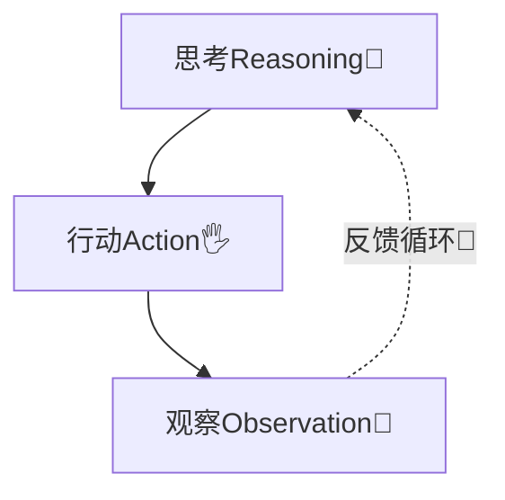

# First,make a piece of garbage

Action First  

<h3>

  </h3>
  
DailySmallProgress
 
   
  

```mermaid
flowchart TD
    A[思考Reasoning🧠] --> B[行动Action🖐️]
    B --> C[观察Observation👀]
    C -.->|反馈循环🔁| A

```
